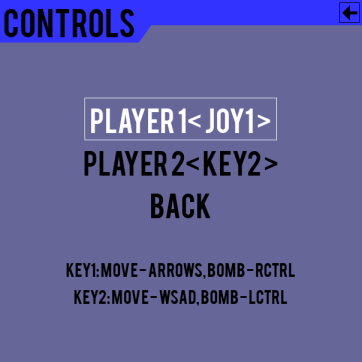

# Bomberman 
 
Bomberman clone written in python using pygame. 
 

 
Game allow to play against two types of AI (Dijkstra Algorithm and Depth-first search) and one friend
 

 
## Controls

KEY1:
Arrows - move 
Right Control - plant bomb 
 
KEY2:
WSAD - move 
Left Control - plant bomb

Game also supports up to 2 gamepads.

## Run 

To run this game you need to install pygame and pygame-menu package
`` 
python3 -m pip install -U pygame --user
python3 -m pip install -U pygame-menu --user
`` 

`` 
python3 launch.py 
`` 
 
For now game is not compatible with python2 
## Sprite 
 
https://opengameart.org/content/bomb-party-the-complete-set 

## Credits

Original author: Michal Sliwa (github.com/Forestf90)

Extended version author: Tomas Novak (github.com/Tommzs)
Improvements:
- support for 2 players
- support for gamepads
- bonuses (fire and bomb)
- code refactoring/improvements